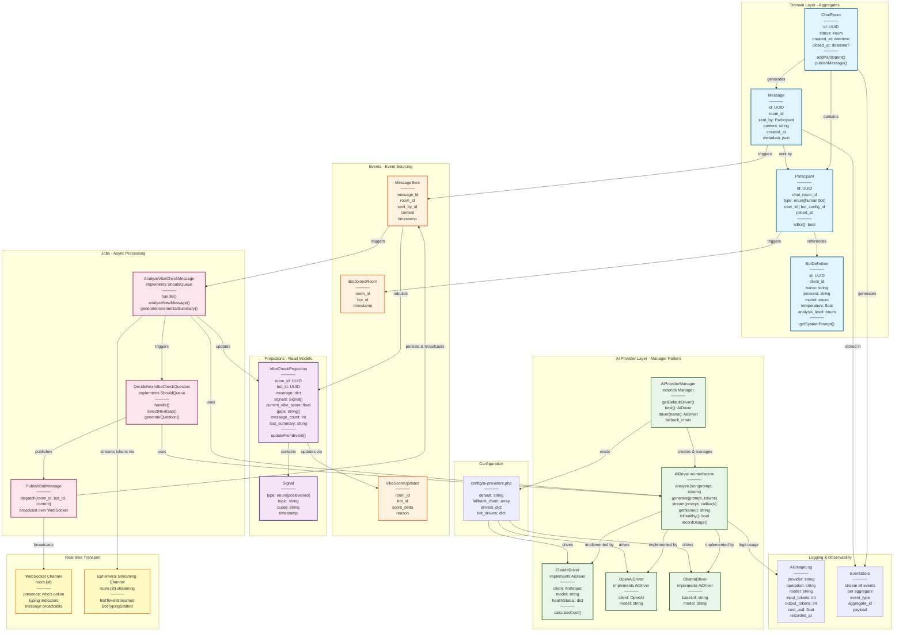

# Hiring Screening Chat System - UML Diagram



## Architecture Layers Explained

### 🟦 Domain Layer (Aggregates)
**The heart of your business logic**

- **ChatRoom**: Root aggregate holding the interview session
- **Participant**: Polymorphic entity (human applicant or bot)
- **Message**: Immutable event record of each exchange
- **BotDefinition**: Client-defined bot configuration (persona, model, behavior)

These are your core domain models—everything else is infrastructure.

---

### 🟧 Event Sourcing Layer
**Immutable history of what happened**

- **MessageSent**: Every message is an event first, persisted second
- **BotJoinedRoom**: Bots entering are events (allows replay/auditing)
- **VibeScoreUpdated**: Scoring updates are versioned (no retroactive changes)

Source of truth = Event Store. Everything else is derived.

---

### 🟪 Projection Layer (CQRS Read Model)
**Optimized for fast reads**

- **VibeCheckProjection**: Redis-cached view of (bot, room) vibe state
  - Evolves incrementally (no full transcript replay)
  - Stores: coverage, signals, score, gaps, summary
  - Cache miss → rebuild from EventStore
  - TTL: 7 days or until room closes

- **Signal**: Granular observations (positive/red flags tied to topics)

This is why you get sub-millisecond lookups despite complex analysis.

---

### 🟩 AI Provider Layer (Manager Pattern)
**Pluggable AI backends**

- **AiProviderManager**: Laravel Manager class for driver registration + fallback
  - Default driver from config
  - Fallback chain if primary fails
  - Per-bot driver overrides
  
- **AiDriver Interface**: Contract all providers implement
  - `analyzeJson()`: Parse messages into signals
  - `generate()`: Create bot responses
  - `stream()`: Token-by-token streaming
  - `isHealthy()`: Health checks before use
  - `recordUsage()`: Cost tracking
  
- **Concrete Drivers**: Claude, OpenAI, Ollama (drop in new ones anytime)

**Why this matters**: You can swap providers without touching bot logic. Test with Ollama locally, run production on Claude.

---

### 🟥 Jobs Layer (Async Processing)
**Non-blocking AI orchestration**

- **AnalyzeVibeCheckMessage** (ShouldQueue)
  - Triggered by MessageSent event
  - Calls driver→analyzeJson()
  - Updates VibeCheckProjection
  - Triggers next job
  
- **DecideNextVibeCheckQuestion** (ShouldQueue)
  - Selects gap in coverage
  - Calls driver→generate()
  - Publishes bot message
  
- **PublishBotMessage**
  - Persists as MessageSent event
  - Broadcasts to room channel

**Applicant UX**: Their message appears instantly (20ms). Bot analysis + response generation happens async in background (2-3 seconds). No blocking.

---

### 🟨 Real-time Transport
**WebSocket-driven UX**

- **Presence Channel** (`room.{id}`)
  - Who's online (applicant, bot 1, bot 2)
  - Message broadcasts
  - Final bot responses pushed here
  
- **Ephemeral Streaming Channel** (`room.{id}.streaming`)
  - Token-by-token bot generation
  - Typing indicators ("Bot is thinking...")
  - Disappears on stream complete

**Why separate**: Final message is persisted; intermediate tokens are ephemeral. No garbage in your database.

---

### 📊 Logging & Observability

- **AiUsageLog**: Every API call tracked
  - Provider, operation, model, tokens, cost
  - Query: "Which bot cost most this week?"
  - Implement quota checks per-bot
  
- **EventStore**: Immutable audit trail
  - Every state change logged
  - Replay capability
  - Compliance/screening appeal records

---

## Data Flow: Applicant Responds

```
┌─────────────────────────────────────────────────────────────┐
│ 1. Applicant types "I love working in teams"                │
└─────────────────────────────────────────────────────────────┘
                            ↓
┌─────────────────────────────────────────────────────────────┐
│ 2. Frontend emits MessageSent event                          │
│    Payload: {message_id, room_id, sent_by: applicant_id}    │
└─────────────────────────────────────────────────────────────┘
                            ↓
┌─────────────────────────────────────────────────────────────┐
│ 3. Message persisted to EventStore                           │
└─────────────────────────────────────────────────────────────┘
                            ↓
┌─────────────────────────────────────────────────────────────┐
│ 4. Broadcast to room.{id} channel                            │
│    ✓ Applicant sees message instantly (20ms)                │
│    ✓ Other participants notified                            │
└─────────────────────────────────────────────────────────────┘
                            ↓
┌─────────────────────────────────────────────────────────────┐
│ 5. Queue AnalyzeVibeCheckMessage job (async)                │
└─────────────────────────────────────────────────────────────┘
                            ↓
         ┌──────────────────┴──────────────────┐
         ↓                                     ↓
   [5 sec later...]                   [Running in worker]
   Applicant refreshes,
   Bot is still typing               1. Load Projection
                                     2. Resolve AiDriver
                                     3. Call analyzeJson()
                                        → Claude analyzes
                                           "love teams" = +0.3 score
                                           topics: [collaboration]
                                           signals: [positive - teamwork]
                                     4. Update Projection
                                        ✓ Score: 6.8 → 7.1
                                        ✓ Coverage: add 'collaboration'
                                        ✓ Signals: add observation
                                     5. Log to AiUsageLog
                                     6. Queue DecideNextQuestion
                                        ↓
                                        Select gap: 'conflict resolution'
                                        Call generate() for question
                                        → Claude responds in 2 sec
                                        → Publish bot message
                                        ↓
                                        Broadcast to room
                                        ✓ Applicant sees:
                                          "Nice! Tell me about a time
                                           you disagreed with a teammate"
```

---

## Config-Driven Behavior

```php
// Use Claude for expensive screening
'bot_drivers' => [
    'senior-tech-bot' => 'claude',
    'culture-fit-bot' => 'best',           // Fallback chain
    'quick-screening-bot' => 'ollama',    // Local/cheap
];

// Fallback if primary provider fails
'fallback_chain' => ['claude', 'openai', 'ollama'];

// Cost: Claude → OpenAI → Ollama (local free)
// Latency: Claude (3s) → OpenAI (2s) → Ollama (500ms)
```

**Result**: Premium screenings get Claude's best output. Budget candidates run on fast local Ollama. No code changes needed.

---

## Why This Architecture?

| Problem | Solution |
|---------|----------|
| **Slow applicant UX** | Async jobs + WebSockets = instant feedback |
| **Expensive LLM calls** | Projection caching + smart re-analysis intervals |
| **Provider lock-in** | Manager pattern + per-bot overrides |
| **Replay/audit trail** | Event sourcing keeps immutable history |
| **Bot context bloat** | Projection holds only signals, not full transcript |
| **Scaling complexity** | Async queue + Redis projection = horizontal scaling |
| **Cost explosion** | Usage logging + driver fallback = cost control |

